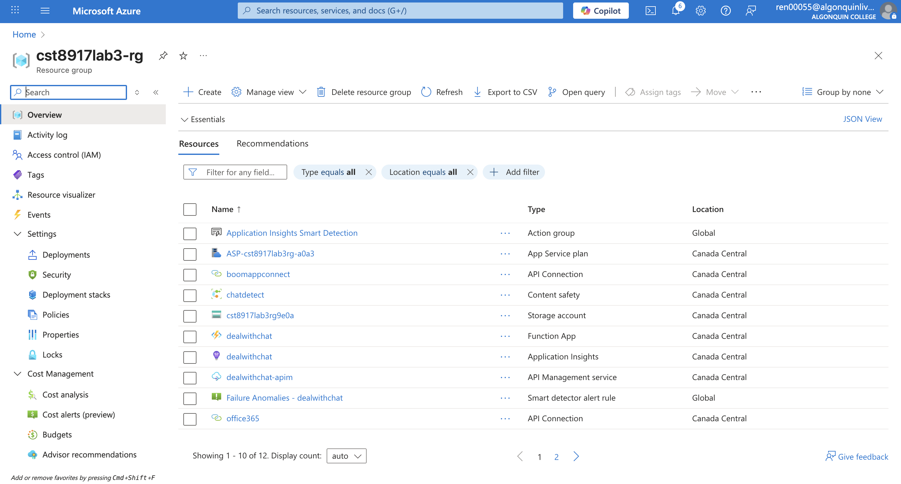
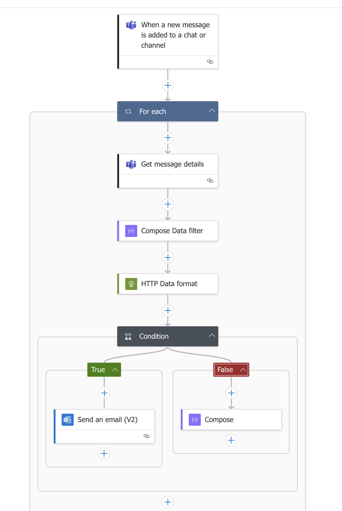
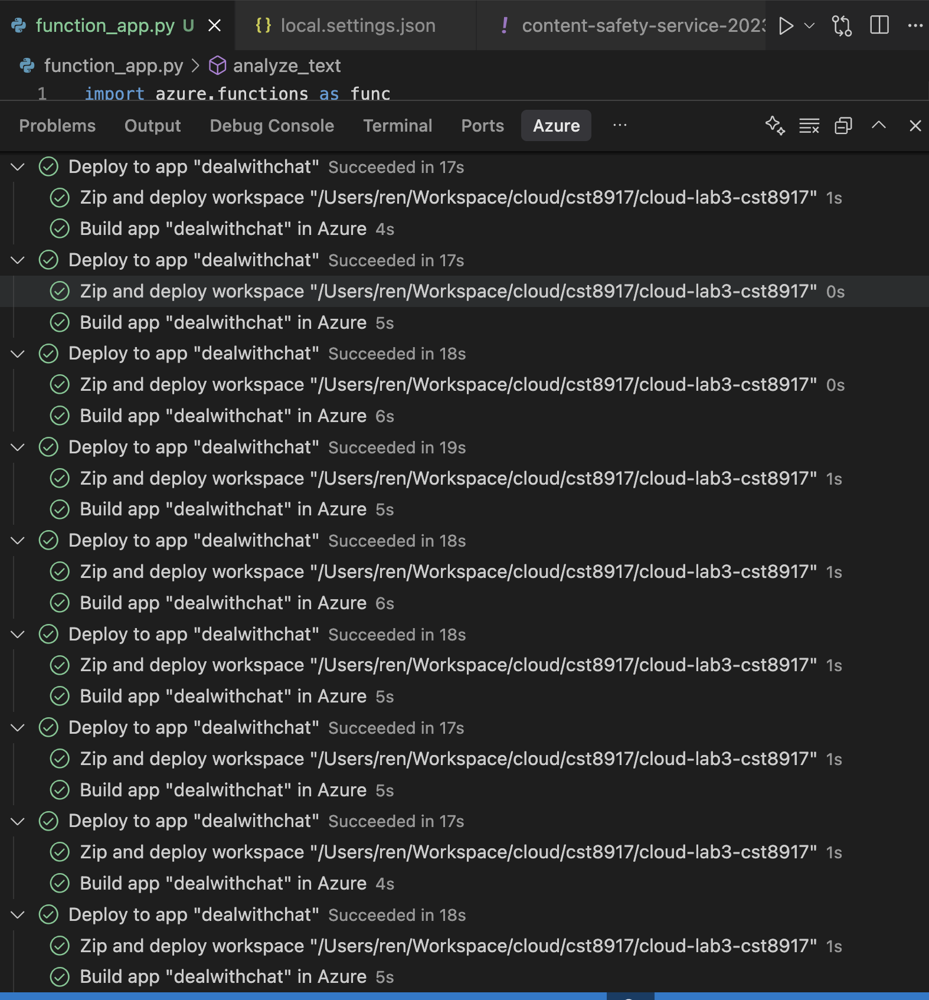
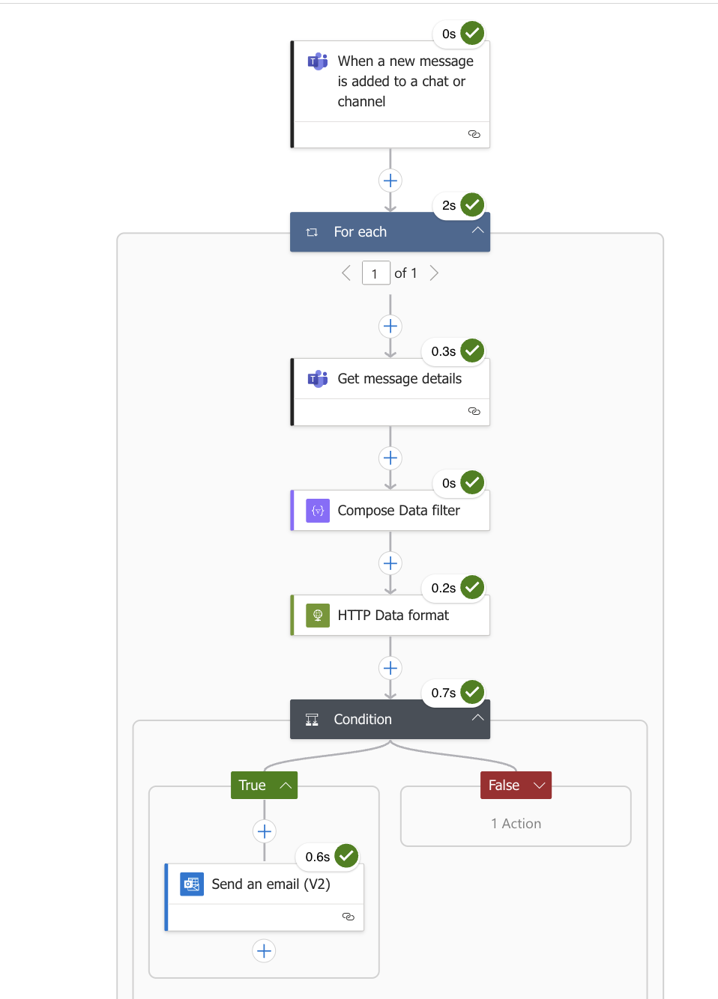

# CST8917 Lab 3: Microsoft Teams Chat Content Moderation Service


## Project Overview

This project implements a Microsoft Teams chat content moderation service based on Azure Logic Apps. The service can monitor Teams chat messages in real-time, detect inappropriate content, and automatically trigger email notifications when policy violations are detected.

### Key Features
- 🔍 **Real-time Monitoring**: Listen to Microsoft Teams chat messages
- 🤖 **Intelligent Moderation**: Use AI technology to analyze message content
- 📧 **Automatic Notifications**: Send email alerts when inappropriate content is detected
- ⚡ **Real-time Response**: Millisecond-level response time
- 🔧 **Scalable Architecture**: Support for Azure Functions and Cognitive Services integration

## Technical Architecture

### Core Technology Stack
- **Azure Logic Apps**: Workflow orchestration and automation
- **Microsoft Teams**: Message source and trigger
- **Azure Cognitive Services for Language**: AI content analysis (optional)
- **Azure Functions**: Message preprocessing (optional)

### Azure Components Overview


### System Architecture Diagram
```
┌─────────────────┐    ┌─────────────────┐    ┌─────────────────┐
│   Microsoft     │    │   Azure Logic   │    │   Email         │
│   Teams         │───▶│   Apps          │───▶│   Notification  │
│   (Trigger)     │    │   (Workflow)    │    │   (Action)      │
└─────────────────┘    └─────────────────┘    └─────────────────┘
                              │
                              ▼
                       ┌─────────────────┐
                       │   Azure         │
                       │   Functions     │
                       │   (Optional)    │
                       └─────────────────┘
                              │
                              ▼
                       ┌─────────────────┐
                       │   Azure         │
                       │   Cognitive     │
                       │   Services      │
                       │   (Optional)    │
                       └─────────────────┘
```

## Implementation Steps

### 1. Design Moderation Workflow
- [x] Create system flowchart
- [x] Define message processing logic
- [x] Design email notification template

#### Workflow Design


### 2. Build Moderation Service
- [x] Set up Azure Logic Apps
- [x] Configure Microsoft Teams trigger
- [x] Implement message processing logic
- [x] Integrate optional services (Functions/Cognitive Services)

#### Azure Function Deployment


### 3. Implement Email Notifications
- [x] Configure email sending logic
- [x] Design notification template
- [x] Test email sending functionality

### 4. Testing and Validation
- [x] Unit testing
- [x] Integration testing
- [x] End-to-end testing


## Features

### Core Features
- ✅ Real-time Teams message monitoring
- ✅ Content violation detection
- ✅ Automatic email notifications
- ✅ Configurable moderation rules

### Optional Enhanced Features
- Azure Functions integration
- AI content analysis
- Security authentication

## Technical Implementation

### Logic Apps Workflow

[Logic Application code](logic_app.json)

## Testing Strategy

### Test Scenarios
1. **Normal Message Testing**: Verify normal messages are not falsely flagged
2. **Violation Content Testing**: Verify inappropriate content is correctly detected


## Deployment Guide

### Prerequisites
- Azure subscription
- Microsoft Teams administrator permissions
- Email service configuration

### Deployment Steps
1. Create Azure Logic Apps resource
2. Configure Teams connector
3. Set up email notifications
4. Test workflow
5. Monitor and optimize


## Monitoring and Maintenance




### Monitoring Metrics
- Message processing volume
- Response time
- Error rate
- Violation detection accuracy

### Maintenance Tasks
- Regularly update moderation rules
- Monitor system performance
- Backup configuration data
- Update dependent services

## Challenges and Solutions

### Common Challenges
1. **Real-time Requirements**: Use Azure Logic Apps real-time triggers
2. **Accuracy Balance**: Combine rules and AI to improve detection accuracy
3. **Scalability Considerations**: Adopt microservice architecture design
4. **Security Assurance**: Implement appropriate access controls

### Solutions
- Use Azure Event Grid to improve real-time performance
- Integrate multiple AI services to improve accuracy
- Adopt containerized deployment to improve scalability
- Implement Azure AD authentication for security

## Future Improvements

### Short-term Improvements
- [ ] Add more moderation rules
- [ ] Optimize AI model performance
- [ ] Implement moderation history records

### Long-term Planning
- [ ] Support multi-language detection
- [ ] Integrate more communication platforms
- [ ] Implement machine learning model training
- [ ] Add advanced analytics features

## Demo Video

📹 **Project Demo**: 


[Demo video](https://youtu.be/iovNjpzth_4)

Demo content includes:
- Logic App workflow demonstration
- Real-time message processing demo
- Email notification feature showcase
- System architecture explanation

